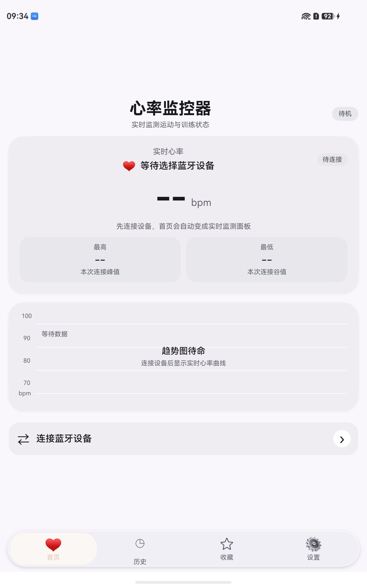
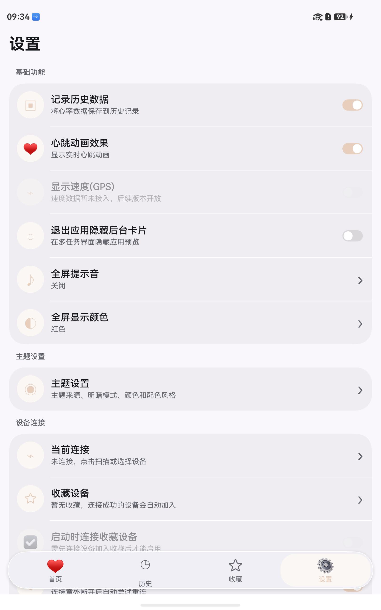

# HeartRate HarmonyOS

[中文说明](README.zh-CN.md)

HeartRate HarmonyOS is a native ArkTS app for Bluetooth heart-rate monitoring. It scans nearby BLE devices, connects to a standard heart-rate sensor, renders live BPM data, and keeps monitoring history on the device.

The project is built as a compact HarmonyOS Stage-model app, with UI, application state, domain contracts, and platform adapters kept in separate layers.

## Screenshots

These screenshots were captured from the app running on a HarmonyOS device.

| Home | Settings |
| --- | --- |
|  |  |

## Download

Download the latest HAP from the [Releases](https://github.com/Yj1axuan/harmonyos-heartrate-monitor/releases/latest) page.

The current public release asset is an unsigned HAP. Some devices and installation flows require a DevEco Studio debug signature or a production signature before installation.

## Features

- Discover nearby Bluetooth heart-rate devices and paired devices.
- Parse the standard BLE Heart Rate Measurement characteristic (`0x2A37`).
- Show live BPM, min/max values, and a real-time trend chart.
- Save monitoring sessions and display session summaries.
- Keep favorite devices for faster reconnection.
- Configure themes, alerts, background monitoring, vibration, sound, and full-screen display.
- Enter a full-screen monitoring mode for workouts and training sessions.

## Tech Stack

- HarmonyOS Stage model
- ArkTS and ArkUI
- DevEco Studio 6.0.0
- HarmonyOS SDK 6.0.0 / API 20
- Hvigor 6.0.6

## Architecture

```text
pages
  -> ui pages
  -> application view models and use cases
  -> domain repository and ports
  -> HarmonyOS data, BLE, permission, alert, and preferences adapters
```

Main directories:

- `entry/src/main/ets/ui`: ArkUI pages and theme.
- `entry/src/main/ets/application`: UI state, view models, and use cases.
- `entry/src/main/ets/domain`: domain models, parser, repository contract, and ports.
- `entry/src/main/ets/data`: HarmonyOS adapters for BLE, storage, preferences, permissions, and alerts.
- `entry/src/main/ets/core/di`: application wiring.

## Build

Open this directory in DevEco Studio, allow project sync, select the `entry` module, then build or run on a HarmonyOS phone or tablet target.

Command-line build:

```powershell
& 'C:\Program Files\Huawei\DevEco Studio\tools\node\node.exe' 'C:\Program Files\Huawei\DevEco Studio\tools\hvigor\bin\hvigorw.js' --mode module -p product=default assembleHap --analyze=normal --parallel --incremental
```

## Signing

The public `build-profile.json5` intentionally does not contain certificate paths or passwords. Keep signing material in DevEco Studio, local private configuration, or CI secrets.

Without a signing config, Hvigor may produce an unsigned HAP and print `No signingConfig found for product default`.

## Compatibility Notes

The app targets HarmonyOS SDK 6.0.0 / API 20. Some Bluetooth APIs used by the BLE adapter require newer API levels than the current compatible SDK value. If you plan to support older devices, review the build warnings and add capability checks or fallback behavior.

## License

MIT
