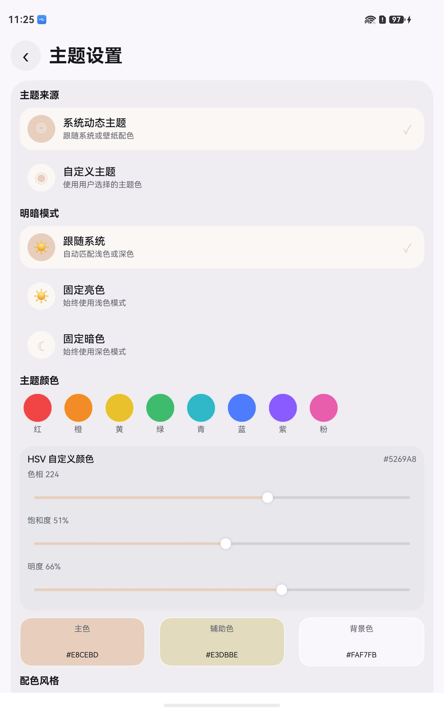

# HeartRate HarmonyOS

[English](README.md)

HeartRate HarmonyOS 是一个使用 ArkTS 开发的 HarmonyOS 原生心率监测应用。应用可以扫描附近的蓝牙心率设备，连接标准 BLE 心率传感器，展示实时 BPM 数据，并在本地保存监测历史。

项目采用 HarmonyOS Stage 模型，按 UI、应用状态、领域接口和平台适配层组织代码，便于继续扩展设备连接、历史记录和预警能力。

## 界面截图

以下截图来自 HarmonyOS 设备上的实际运行效果。

| 首页 | 设置 | 主题设置 |
| --- | --- | --- |
|  |  |  |

## 下载

最新 HAP 可以从 [Releases](https://github.com/Yj1axuan/harmonyos-heartrate-monitor/releases/latest) 页面下载。

当前公开发布附件是未签名 HAP。部分设备或安装方式需要使用 DevEco Studio 调试签名，或使用正式发布签名后再安装。

## 功能

- 扫描附近蓝牙心率设备和已配对设备。
- 解析标准 BLE Heart Rate Measurement 特征值（`0x2A37`）。
- 显示实时 BPM、最高/最低心率和趋势图。
- 保存监测会话，并展示历史汇总。
- 收藏常用设备，便于后续快速重连。
- 支持主题、心率预警、后台监测、振动、提示音和全屏显示设置。
- 提供适合运动和训练场景的全屏监测模式。

## 技术栈

- HarmonyOS Stage 模型
- ArkTS 和 ArkUI
- DevEco Studio 6.0.0
- HarmonyOS SDK 6.0.0 / API 20
- Hvigor 6.0.6

## 架构

```text
pages
  -> ui pages
  -> application view models and use cases
  -> domain repository and ports
  -> HarmonyOS data, BLE, permission, alert, and preferences adapters
```

主要目录：

- `entry/src/main/ets/ui`：ArkUI 页面和主题。
- `entry/src/main/ets/application`：UI 状态、ViewModel 和用例。
- `entry/src/main/ets/domain`：领域模型、解析器、仓储契约和端口。
- `entry/src/main/ets/data`：BLE、存储、偏好设置、权限和预警的平台适配器。
- `entry/src/main/ets/core/di`：应用依赖装配。

## 构建

使用 DevEco Studio 打开项目目录，等待项目同步完成，选择 `entry` 模块后在 HarmonyOS 手机或平板目标上构建运行。

命令行构建：

```powershell
& 'C:\Program Files\Huawei\DevEco Studio\tools\node\node.exe' 'C:\Program Files\Huawei\DevEco Studio\tools\hvigor\bin\hvigorw.js' --mode module -p product=default assembleHap --analyze=normal --parallel --incremental
```

## 签名

公开仓库中的 `build-profile.json5` 不包含证书路径或密码。签名材料应保存在 DevEco Studio、本地私有配置或 CI Secrets 中。

如果没有签名配置，Hvigor 可能会生成未签名 HAP，并输出 `No signingConfig found for product default`。

## 兼容性说明

应用目标版本为 HarmonyOS SDK 6.0.0 / API 20。BLE 适配器中使用的部分蓝牙 API 高于当前 compatible SDK 值。如果需要兼容更低版本设备，建议根据构建警告补充能力检测或降级逻辑。

## 许可证

MIT
